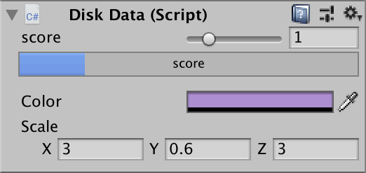

1、编写一个简单的鼠标打飞碟（Hit UFO）游戏

- 游戏规则：
  1. 游戏至少有三个 round（其实到round3就很容易死了。）
  2. 每个round内难度一样，但是不同round难度递增。
  3. 每个round中飞碟出现的位置是随机的。
  4. 鼠标点中得分，紫飞碟1分，绿飞碟3分，红飞碟5分。
  5. 每次游戏有6条命，少点一个掉一条命，没有命游戏结束。
- 游戏的要求：
  - 使用带缓存的工厂模式管理不同飞碟的生产与回收，该工厂必须是场景单实例的！具体实现见参考资源 Singleton 模板类
  - 近可能使用前面 MVC 结构实现人机交互与游戏模型分离
- 扩展：
  - 用自定义组件定义几种飞碟，编辑并赋予飞碟一些属性，做成预制


UML类图：

因为我参考了前辈的代码，UML类图几乎一样，所以直接借用了（末尾有前辈的链接）。


其中SSAction、SequenceAction、ActionCallBack、ActionManager与上次的牧师与魔鬼几乎相同，所以这次不多加说明，主要关注新增的类。

##### UFOFlyAction

这个类是SSAction的实现，写了UFO做的动作，包括飞的速度、射出位置、射出角度的方法，以及动作结束的条件。当动作结束，飞碟会等待回收。

```c#
public static UFOFlyAction GetSSAction(Vector3 direction, float angle, float power){
        //初始化物体将要运动的初速度向量
    UFOFlyAction action = CreateInstance<UFOFlyAction>();
    if (direction.x == -1) {
    		action.start_vector = Quaternion.Euler(new Vector3(0, 0, -angle)) * Vector3.left * power;
    }else{
        action.start_vector = Quaternion.Euler(new Vector3(0, 0, angle)) * Vector3.right * power;
    }
    return action;
}
public override void Update(){
        //计算物体的向下的速度,v=at
		time += Time.fixedDeltaTime;
    gravity_vector.y = gravity * time;

        //位移模拟
    transform.position += (start_vector + gravity_vector) * Time.fixedDeltaTime;
    current_angle.z = Mathf.Atan((start_vector.y + gravity_vector.y) / start_vector.x) * Mathf.Rad2Deg;
    transform.eulerAngles = current_angle;

        //如果物体y坐标小于-5，动作就做完了
    if (this.transform.position.y < -5){
        this.destroy = true;
        this.whoToNotify.SSActionEvent(this);      
    }
}
```

##### FlyAtionManager

当场景控制器需要飞碟飞出来时，它会调用上面动作管理类的方法，来控制飞碟飞行。它们的关系可以理解为，飞碟能做的动作在动作管理类，但是飞碟要做什么是由这个控制器控制的，场景控制器决定飞碟在什么情况下动作。

```c#
public UFOFlyAction fly;                            //飞碟飞行的动作
public FirstController scene_controller; 					//场景管理类

protected void Start() {
    scene_controller = (FirstController)SSDirector.GetInstance().CurrentScenceController;
  	scene_controller.action_manager = this;     
}
    //飞碟飞行
public void UFOFly(GameObject disk, float angle, float power) {
    fly = UFOFlyAction.GetSSAction(disk.GetComponent<DiskData>().direction, angle, power);
    this.RunAction(disk, fly, this);
}
```

##### MyDiskEditor

做了三种飞碟的预置，将这个编辑脚本挂载在它们上面，就可以用来编辑他们的属性。

```c#
SerializedProperty score;                              //分数
SerializedProperty color;                              //颜色
SerializedProperty scale;                              //大小

void OnEnable()
{
        //序列化对象后获得各个值
    score = serializedObject.FindProperty("score");
    color = serializedObject.FindProperty("color");
    scale = serializedObject.FindProperty("scale");
}
public override void OnInspectorGUI(){
        //开启更新
    serializedObject.Update();
        //设置滑动条
    EditorGUILayout.IntSlider(score, 0, 5, new GUIContent("score"));
  
    if (!score.hasMultipleDifferentValues){
            //显示进度条
        ProgressBar(score.intValue / 5f, "score");
    }
        //显示值
    EditorGUILayout.PropertyField(color);
    EditorGUILayout.PropertyField(scale);
        //应用更新
    serializedObject.ApplyModifiedProperties();
}
private void ProgressBar(float value, string label){
    Rect rect = GUILayoutUtility.GetRect(18, 18, "TextField");
    EditorGUI.ProgressBar(rect, value, label);
        //中间留一个空行
    EditorGUILayout.Space();
}
```

然后就可以可视化地编辑这些参数。



##### DiskFactory

现在我们已经有了飞碟的预设，需要用工厂来生产并回收这些飞碟了。核心的思路是：将飞碟分类，要使用一个飞碟时，在空闲列表里找到空闲的相同飞碟，如果没有空闲，就新建一个飞碟来使用。而一个飞碟使用完之后，就将它加到空闲列表里面等待再次被使用。

```c#
public class DiskFactory : MonoBehaviour
{
    public GameObject disk_prefab = null;                 //飞碟预制体
    private List<DiskData> used = new List<DiskData>();   //正在被使用的飞碟列表
    private List<DiskData> free = new List<DiskData>();   //空闲的飞碟列表

    public GameObject GetDisk(int round)
    {
        int choice = 0;
        int scope1 = 1, scope2 = 4, scope3 = 7;           //随机的范围
        float start_y = -10f;                             //刚实例化时的飞碟的竖直位置
        string tag;
        disk_prefab = null;

        //根据回合，随机选择要飞出的飞碟
        if (round == 1){
            choice = Random.Range(0, scope1);
        }else if(round == 2){
            choice = Random.Range(0, scope2);
        }else{
            choice = Random.Range(0, scope3);
        }
        //将要选择的飞碟的tag
        if(choice <= scope1){
            tag = "disk1";
        }else if(choice <= scope2 && choice > scope1){
            tag = "disk2";
        }else{
            tag = "disk3";
        }
        //寻找相同tag的空闲飞碟
        for(int i=0;i<free.Count;i++){
            if(free[i].tag == tag) {
                disk_prefab = free[i].gameObject;
                free.Remove(free[i]);
                break;
            }
        }
        //如果空闲列表中没有，则重新实例化飞碟
        if(disk_prefab == null){
            if (tag == "disk1"){
                disk_prefab = Instantiate(Resources.Load<GameObject>("Prefabs/disk1"), new Vector3(0, start_y, 0), Quaternion.identity);
            }else if (tag == "disk2"){
                disk_prefab = Instantiate(Resources.Load<GameObject>("Prefabs/disk2"), new Vector3(0, start_y, 0), Quaternion.identity);
            }else {
                disk_prefab = Instantiate(Resources.Load<GameObject>("Prefabs/disk3"), new Vector3(0, start_y, 0), Quaternion.identity);
            }
            //给新实例化的飞碟赋予其他属性
            float ran_x = Random.Range(-1f, 1f) < 0 ? -1 : 1;
            disk_prefab.GetComponent<Renderer>().material.color = disk_prefab.GetComponent<DiskData>().color;
            disk_prefab.GetComponent<DiskData>().direction = new Vector3(ran_x, start_y, 0);
            disk_prefab.transform.localScale = disk_prefab.GetComponent<DiskData>().scale;
        }
        //添加到使用列表中
        used.Add(disk_prefab.GetComponent<DiskData>());
        return disk_prefab;
    }

    //回收飞碟
    public void FreeDisk(GameObject disk){
        for(int i = 0;i < used.Count; i++){
            if (disk.GetInstanceID() == used[i].gameObject.GetInstanceID()) {
                used[i].gameObject.SetActive(false);
                free.Add(used[i]);
                used.Remove(used[i]);
                break;
            }
        }
    }
}
```

##### ScoreRecorder

每个飞碟都有自己的分数，将这个分数分离出来，有点类似之前的裁判类。

```c#
public void Record(GameObject disk){
    int temp = disk.GetComponent<DiskData>().score;
    score = temp + score;
}
```

##### FirstController

这是游戏的场景控制器，用来控制游戏场景。游戏有三个状态，分别是游戏开始、进行中和结束。用这三个状态来控制游戏对象的行为。

Update中写了游戏不同round的改变（游戏的生命周期）。

```c#
		void Update () {
        if(game_start){
            //游戏结束，取消定时发送飞碟
            if (game_over) {
                CancelInvoke("LoadResources");
            }
            //设定一个定时器，发送飞碟，游戏开始
            if (!playing_game) {
                InvokeRepeating("LoadResources", 1f, speed);
                playing_game = true;
            }
            //发送飞碟
            SendDisk();
            //回合升级
            if (score_recorder.score >= score_round2 && round == 1)
            {
                round = 2;
                StartCoroutine(WaitingASecond2(1));
                //缩小飞碟发送间隔
                speed = speed - 0.6f;
                CancelInvoke("LoadResources");
                playing_game = false;
            }
            else if (score_recorder.score >= score_round3 && round == 2)
            {
                round = 3;
                StartCoroutine(WaitingASecond3(1));
                speed = speed - 0.5f;
                CancelInvoke("LoadResources");
                playing_game = false;
            }
        }
    }
```

具体的发送飞碟也在场景控制器中实现。

```c#
		private void SendDisk()
    {
        float position_x = 16;                       
        if (disk_queue.Count != 0)
        {
            GameObject disk = disk_queue.Dequeue();
            disk_notshot.Add(disk);
            disk.SetActive(true);
            //设置被隐藏了或是新建的飞碟的位置
            float ran_y = Random.Range(0f, 15f);
            float ran_x = Random.Range(-1f, 1f) < 0 ? -1 : 1;
            disk.GetComponent<DiskData>().direction = new Vector3(ran_x, ran_y, 0);
            Vector3 position = new Vector3(-disk.GetComponent<DiskData>().direction.x * position_x, ran_y, 0);
            disk.transform.position = position;
            //设置飞碟初始所受的力和角度
            float power = Random.Range(10f, 15f);
            float angle = Random.Range(15f, 30f);
            action_manager.UFOFly(disk,angle,power);
        }

        for (int i = 0; i < disk_notshot.Count; i++)
        {
            GameObject temp = disk_notshot[i];
            //飞碟飞出摄像机视野也没被打中
            if (temp.transform.position.y < -5 && temp.gameObject.activeSelf == true)
            {
                disk_factory.FreeDisk(disk_notshot[i]);
                disk_notshot.Remove(disk_notshot[i]);
                //玩家血量-1
                user_gui.ReduceBlood();
            }
        }
    }
```

与用户的交互：打飞碟之后的一系列行为。

```c#
public void Hit(Vector3 pos){
        Ray ray = Camera.main.ScreenPointToRay(pos);
        RaycastHit[] hits;
        hits = Physics.RaycastAll(ray);
        bool not_hit = false;
        for (int i = 0; i < hits.Length; i++) {
            RaycastHit hit = hits[i];
            //射线打中物体
            if (hit.collider.gameObject.GetComponent<DiskData>() != null) {
                //射中的物体要在没有打中的飞碟列表中
                for (int j = 0; j < disk_notshot.Count; j++) {
                    if (hit.collider.gameObject.GetInstanceID() == disk_notshot[j].gameObject.GetInstanceID()) {
                        not_hit = true;
                    }
                }
                if(!not_hit) {
                    return;
                }
                disk_notshot.Remove(hit.collider.gameObject);
                //记分员记录分数
                score_recorder.Record(hit.collider.gameObject);
                //显示爆炸粒子效果
                Transform explode = hit.collider.gameObject.transform.GetChild(0);
                explode.GetComponent<ParticleSystem>().Play();
                //等0.1秒后执行回收飞碟
                StartCoroutine(WaitingParticle(0.08f, hit, disk_factory, hit.collider.gameObject));
                break;
            }
        }
    }
```

另外为了更好的游戏体验，我还在游戏开始之前设置了倒计时，给玩家准备的时间。

```c#
		IEnumerator WaitingOneSecond(float wait_time) {   
        while (CoolTimes >=0 && game_wait == true ) {
          	yield return new WaitForSeconds(wait_time);
           	CoolTimes --;
        }  
        game_start = true;
    }

		public void BeginGame(){   
        StartCoroutine(WaitingOneSecond(1));
    }
```

到此的游戏设计思路基本就阐述完毕了，工厂类能够有效的控制飞碟的生产与回收来节约资源。这个游戏还能通过鼠标来与玩家交互，整体上趣味性还是比较强的。

最终的游戏界面。


[项目仓库](https://github.com/anjahappy/3DGameHomework5.git)

[参考资料](https://blog.csdn.net/c486c/article/details/79952255)